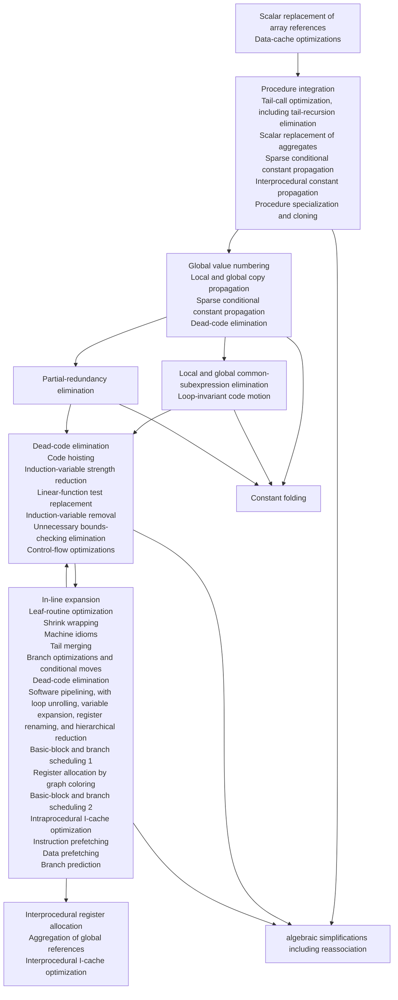

# Compiler2026-NO_COMPILE_NO_LIFE

## 进度

### TODO

- MagicNumber不可用/寄存器分配有错误
- algebra Simplify 无法处理非二次幂除法
- CSE负作用
- dce中removeDeadBlocks不可用   
- 主要优化测试集: `performance/huffman*` `performance/matmul*` `performance/many_mat_cal*`

### Mid

> 块内疑似并非顺序排列

#### A
- [ ] Scalar replacement of array references → 数组引用的标量替换
- [ ] Data-cache optimizations → 数据缓存优化

#### B
- [X] Scalar replacement of aggregates (*mem2reg*) → 聚合体的标量替换
- [ ] Procedure integration → 过程集成（过程内联）
- [X] Tail-call optimization, including tail-recursion elimination → 尾调用优化（包括尾递归消除）
- [ ] Sparse conditional constant propagation → 稀疏条件常量传播
- [X] Interprocedural constant propagation → 过程间常量传播
- [ ] Procedure specialization and cloning → 过程特化与克隆
- [ ] Sparse conditional constant propagation → 稀疏条件常量传播

#### C1
- [ ] Global value numbering → 全局值编号
- [X] Local and global copy propagation → 局部与全局拷贝传播
- [ ] Sparse conditional constant propagation → 稀疏条件常量传播
- [ ] Dead-code elimination → 死代码消除

#### C2
- [X] Local and global common-subexpression elimination → 局部与全局公共子表达式消除
- [ ] Loop-invariant code motion → 循环不变代码外提

#### C3
- [ ] Partial-redundancy elimination → 部分冗余消除

#### C4
- [ ] Dead-code elimination → 死代码消除
- [ ] Code hoisting → 代码上提
- [ ] Induction-variable strength reduction → 归纳变量强度削弱
- [ ] Linear-function test replacement → 线性函数测试替换
- [ ] Induction-variable removal → 归纳变量删除
- [ ] Unnecessary bounds-checking elimination → 不必要的边界检查消除
- [ ] Control-flow optimizations → 控制流优化

#### D
- [ ] In-line expansion → 内联展开
- [ ] Leaf-routine optimization → 叶例程优化
- [ ] Shrink wrapping → 收缩包装
- [ ] Machine idioms → 机器习语
- [ ] Tail merging → 尾合并
- [ ] Branch optimizations and conditional moves → 分支优化与条件传送
- [ ] Dead-code elimination → 死代码消除
- [ ] Software pipelining, with loop unrolling, variable expansion, register renaming, and hierarchical reduction → 软件流水（含循环展开、变量扩展、寄存器重命名和层次化归约）
- [ ] Basic-block and branch scheduling 1 → 基本块与分支调度 1
- [ ] Register allocation by graph coloring → 图着色寄存器分配
- [ ] Basic-block and branch scheduling 2 → 基本块与分支调度 2
- [ ] Intraprocedural I-cache optimization → 过程内指令缓存优化
- [ ] Instruction prefetching → 指令预取
- [ ] Data prefetching → 数据预取
- [ ] Branch prediction → 分支预测

#### E
- [ ] Interprocedural register allocation → 过程间寄存器分配
- [ ] Aggregation of global references → 全局引用的聚合
- [ ] Interprocedural I-cache optimization → 过程间指令缓存优化

#### 附加（来自图末尾）
- [X] Constant folding → 常量折叠
- [X] Algebraic simplifications → 代数简化
- [ ] Reassociation → 重组
    


### backend

- [X] 线性扫描分配寄存器
- [ ] 图着色分配寄存器
- [X] 多线程 

## 项目结构

```text
root/
├── archive/
├── lib/
├── test/
└── src/
    ├── include/
    ├── frontend/
    ├── mid/
    ├── backend/
    └── main.cpp
```
- `archive/`下存放了可进行正确性测试的脚本（-O0），运行后会在根目录生成`checklist.md`

## 项目运行

使用根目录下使用docker搭建环境，推荐使用以下命令以防止flex/bison生成文件里包含特定用户路径：
```bash
docker build --platform linux/arm64 -t sysy-dev .; docker run -it --platform linux/arm64 -v $(pwd):/workspace sysy-dev
# 项目代码会放在 /workspace 下
```

在根目录下构建：
```bash
mkdir build && cd build && cmake .. && make -j4
```

在`build/`下运行:
```bash
./compiler <.sy path> > out.s
gcc out.s ../lib/libsysy.a -o out
```

对`performance/`采用批量测试，在`test/`下运行：
```bash
./run_tests.sh
```

## `git commit`规范

**为了diff可读性，commit前建议检查是否开启了ide的auto formatting**

```
<类型>(<范围>): <主题>

<正文>

<页脚>
```
| 类型 | 含义 | 示例 |
|------|------|------|
| `feat` | 新功能 | `feat(auth): add login with Google` |
| `fix` | 修复bug | `fix(cart): resolve total price miscalculation` |
| `docs` | 文档变更 | `docs(readme): update installation guide` |
| `style` | 代码格式（不影响逻辑） | `style: format with prettier` |
| `perf` | 性能优化 | `perf(list): add virtual scrolling` |
| `test` | 增加或修改测试 | `test: add unit tests for validator` |
| `chore` | 构建/工具/依赖变更 | `chore: upgrade vite to v5` |
| `revert` | 回滚某次提交 | `revert: revert "feat: add login"` |
| `refactor` | 重构（上述类型都不匹配时） | `refactor(api): extract common http client` |

- 主题使用祈使句、现在时，末尾不用加句号
- `commit`前检查无关文件，使用`.gitignore`排除
- ~~或者用简洁中文表达也可以~~